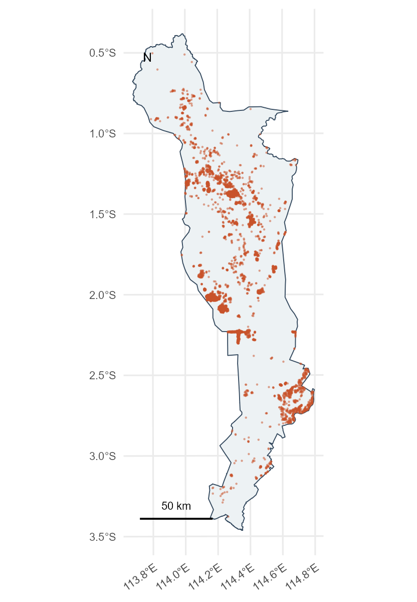
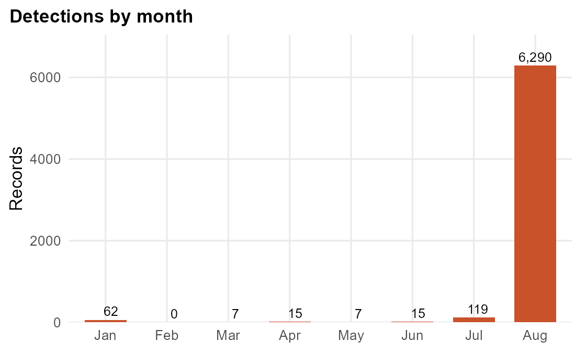
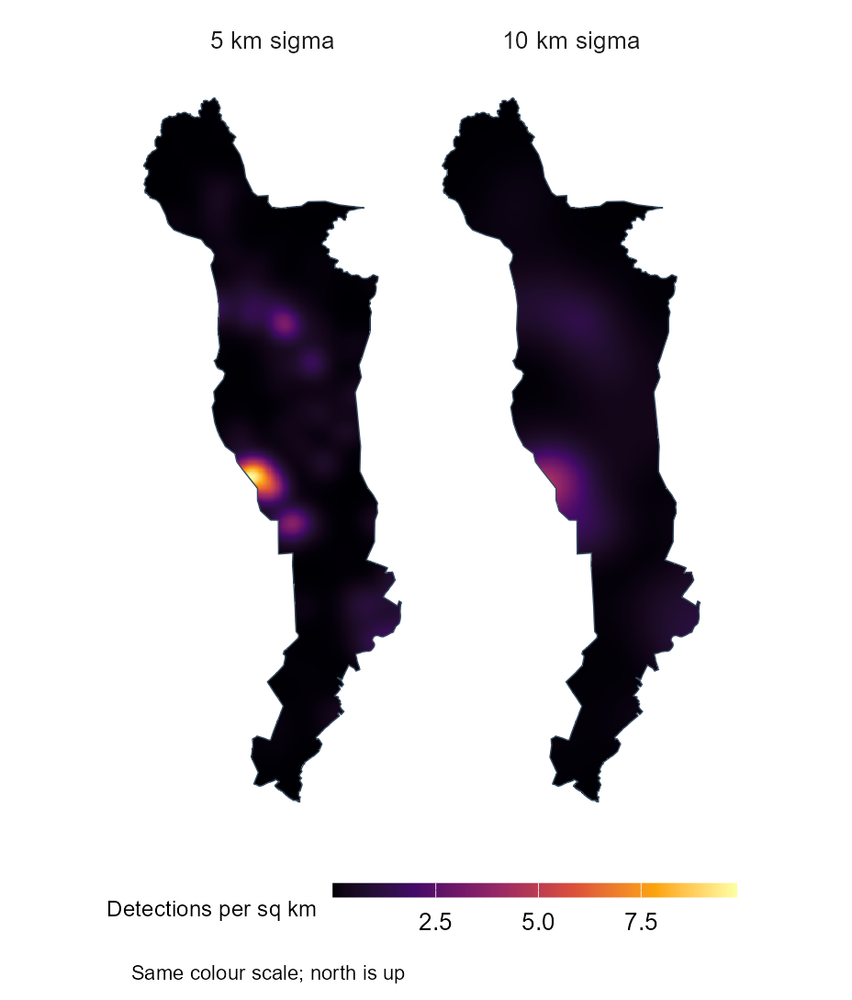
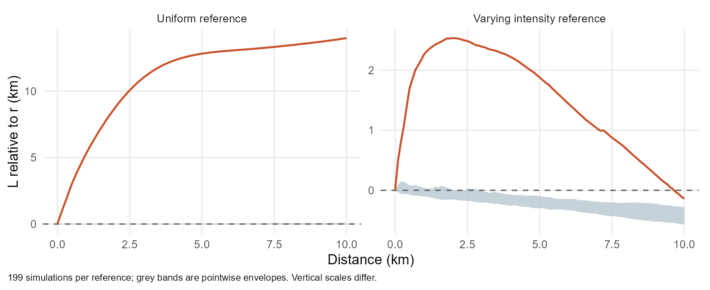

```{r}
#| include: false
source('R/cache-guard.R',encoding='UTF-8')
verify_analysis_fingerprint()
source('R/03-presentation-figures.R',encoding='UTF-8')
```

## 1 · What does this exercise investigate?

**Where are thermal detections concentrated in Kapuas, and how might the patterns help public safety planning?**

* Describe where and when detections occur.
* Use KDE to explore local intensity.
* Use L functions to compare nearby detections with two spatial reference patterns.

::: {.takeaway}
Each point is a satellite observation. Several observations may come from the same fire.
:::

## 2 · Study area and data

::: {.columns}
::: {.column width="43%"}
{height=530 fig-alt="Thermal detections within Kapuas Regency."}
:::
::: {.column width="57%"}
**Kapuas, Central Kalimantan**

* 1 January to 31 August 2026.
* NASA FIRMS VIIRS on Suomi NPP, 375 m, Collection 2.
* County area: approximately **17,058 km²**.
* BIG boundary and UTM zone 50S for spatial analysis.

::: {.small}
Kapuas and the period were chosen before testing the pattern. Sources: FIRMS request 804686 and BIG boundary object 526.
:::
:::
:::

## 3 · Preparing the observations

| Step | Records |
|:---|---:|
| Indonesia download | 199,798 |
| Within Kapuas before confidence filtering | 6,716 |
| Low confidence detections removed | 201 |
| Retained for analysis | **6,515** |

Coordinates, dates and geometry passed the checks. There were no duplicate observation keys.

**Main limitation:** 6,431 retained records have no hotspot type. The analysis therefore describes thermal detections, including one known static source, rather than confirmed forest fires.

## 4 · Where and when are detections concentrated?

::: {.columns}
::: {.column width="55%"}
{width=640 fig-alt="Monthly totals showing that August contains most detections."}

**August: 6,290 detections, or 96.5% of the total.**

::: {.small}
Counts are not adjusted for satellite coverage. A month with zero records does not prove that no fires occurred.
:::
:::
::: {.column width="45%"}
{height=440 fig-alt="KDE surfaces with sigma of 5 and 10 kilometres."}

::: {.small}
Both bandwidths retain the main western peak near 2.0°S. Broader smoothing merges smaller peaks; rank correlation is **0.912**.
:::
:::
:::

## 5 · Are nearby detections more common than expected?

{width=1100 height=390 fig-alt="L curves compared with uniform and varying intensity references."}

* Both curves exceed their envelopes from **0.5 to 10 km**.
* Adjusting for spatial intensity makes the departure smaller.
* The bands apply at individual distances. The second comparison depends on the estimated intensity model.

## 6 · Bringing the results together

**Location:** the maps show several concentrations, with the main KDE peak near the western boundary at 2.0°S.

**Timing:** the pooled spatial pattern mainly represents August 2026.

**Neighbouring detections:** the L curves show more local concentration than the two references. Repeated observations of one fire and finer environmental differences remain possible explanations.

::: {.takeaway}
These are useful places to investigate further. The results do not identify separate interacting fires or explain their causes.
:::

## 7 · What should we be careful about?

* **Coverage:** 13 dates have no records in the national download; the reason is uncertain.
* **Classification:** NRT records lack hotspot type, and forest cover was not checked.
* **Time:** eight months and mixed processing levels do not establish a typical annual pattern.
* **Methods:** bandwidth and the county boundary affect detail; the adjusted reference is a diagnostic comparison.
* **Risk:** no population, damage or travel time data are included.

## 8 · How could this support public safety planning?

1. **Check the main concentrations** against incident records and recent imagery.
2. **Review the timing of preparedness** using several years of consistently processed observations.
3. **Add exposure and access data** before deciding where resources are most needed.

The results support county planning and further investigation. Current emergency decisions would need current information verified locally.

::: {.small}
[Technical report and references](technical-report.html) · [Exercise overview](Take-home_Ex01.html) · [NASA FIRMS documentation](https://firms.modaps.eosdis.nasa.gov/download/Readme.txt)
:::
