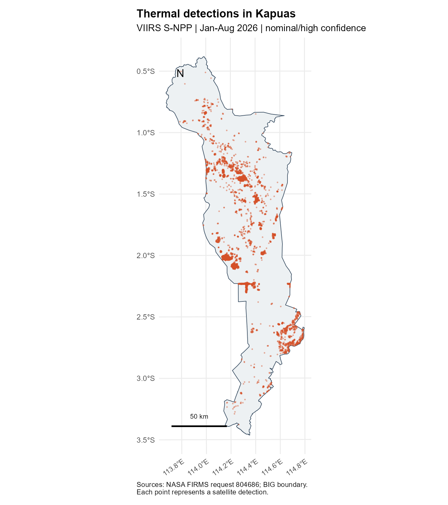
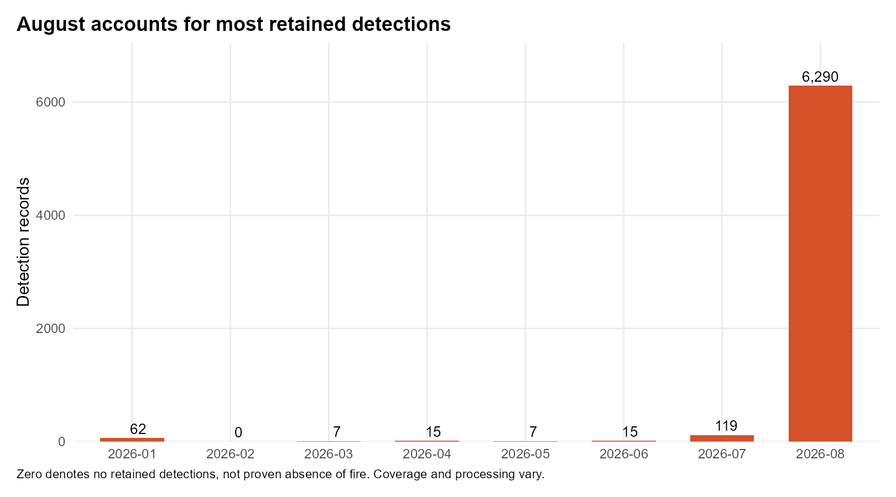
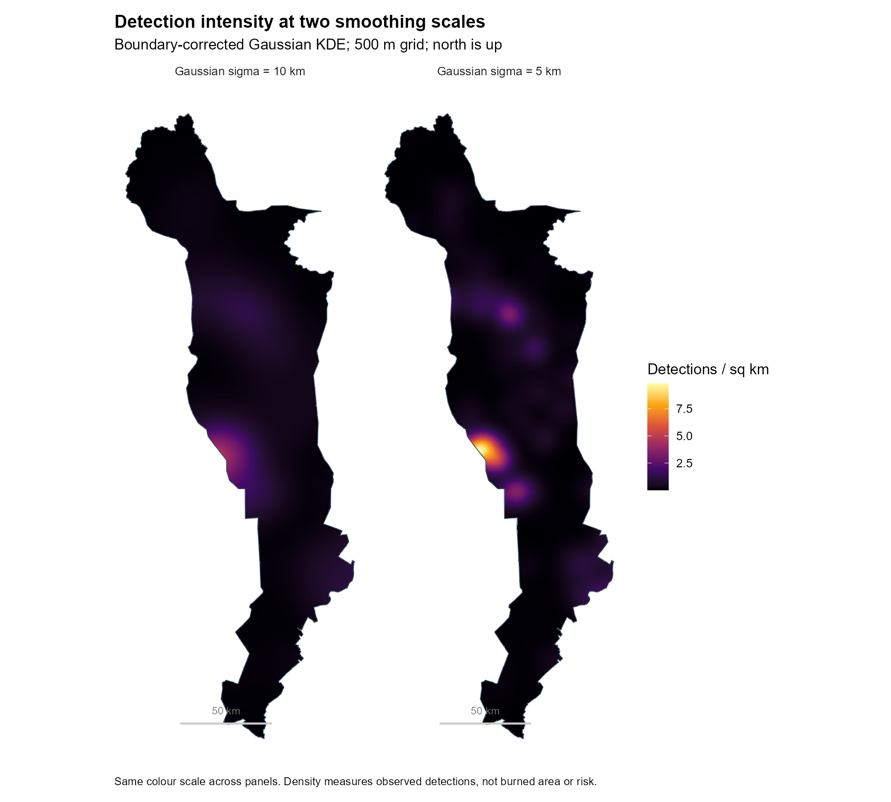
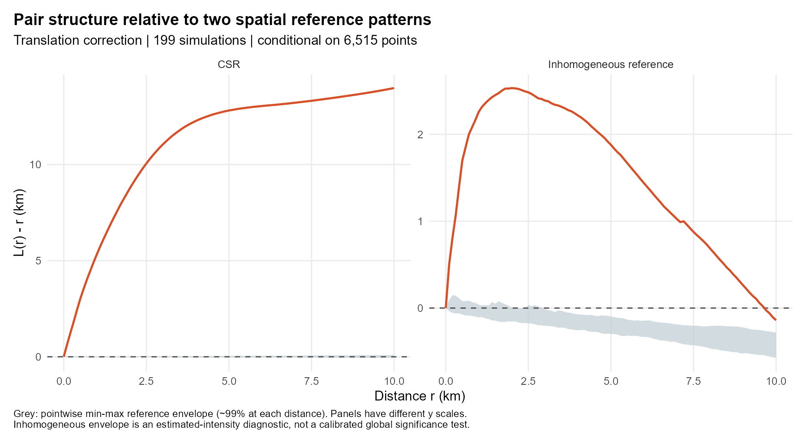

[Exercise overview](Take-home_Ex01.qmd) · [Executive summary](executive-summary.qmd)

```{r}
#| label: reproduce-analysis
#| include: false
# A normal render runs the entire analysis from local raw inputs.
source('R/cache-guard.R',local=TRUE,encoding='UTF-8')
if (isTRUE(params$recompute)) {
  source('R/01-prepare.R',local=TRUE,encoding='UTF-8')
  source('R/02-analyse.R',local=TRUE,encoding='UTF-8')
  record_analysis_fingerprint()
} else verify_analysis_fingerprint()
res <- readRDS('data/processed/results.rds')
first <- readRDS('data/processed/first-order.rds')
fmt <- function(x,digits=0) format(round(x,digits),big.mark=',',trim=TRUE,nsmall=digits)
```

## Introduction and research questions

In this exercise, I explore thermal detections in Kapuas Regency, Central Kalimantan, from 1 January to 31 August 2026. I use the first-order and second-order methods introduced in class to examine where the detections occur and how they are grouped. For the forest fire case in this assignment, the aim is to identify areas that deserve closer checking. Kapuas and the study period were selected before looking at the statistical results. Each point represents a satellite observation, so several points may come from the same fire.

Three questions guide the work:

1. Where and when are retained detections concentrated?
2. Are nearby detections more common than expected under uniform and spatially varying reference patterns?
3. What planning uses are supported, and what further evidence would be needed?

After cleaning, **`r fmt(res$summary$n)` detections** remain, with **`r fmt(100*res$summary$august_share,1)`%** recorded in August. The main density peak is on the western side of the county, near 2.0°S. These results mainly describe the activity observed in August; they do not establish the usual pattern for a whole year.

## Data and study design

### Sources and provenance

| Input | Product and coverage | Provenance |
|---|---|---|
| Thermal anomalies | NASA FIRMS VIIRS S-NPP 375 m, Collection 2; Indonesia, Jan-Aug 2026 | Request 804686; ZIP and both CSVs preserved; imported into this project on 14 September 2026 (Singapore time) |
| Administrative window | Kapuas, Kalimantan Tengah, code 62.03 | BIG layer 13, object 526; metadata TASWIL5000020240905KABKOTA; retrieved on 13 September 2026 (Singapore time) |

I obtained the county polygon from BIG's administrative boundary service, which is linked from the [boundary source given in the assignment](https://www.indonesia-geospasial.com/2023/05/download-shapefile-batas-administrasi.html). Source links, file checksums and acquisition details are saved in `_workflow/acquisition.json`. The BIG metadata does not state a redistribution licence; this needs checking before sharing the raw boundary file publicly.

FIRMS supplies standard/archive and near-real-time (NRT) records separately, replacing NRT records with standard processing as available. Combining their time periods requires retaining the source/version flag ([NASA download README](https://firms.modaps.eosdis.nasa.gov/download/Readme.txt)).

```{r}
knitr::kable(read.csv('output/tables/source-profile.csv'),caption='Actual file coverage, before filtering.')
```

### Observation unit and scope

One observation is a nominal- or high-confidence S-NPP thermal detection at a reported coordinate and UTC acquisition date/time. A unique key combines satellite, date, time, latitude and longitude. Distinct observations at different times remain distinct, even if they may describe the same ongoing fire. No aggregation into incidents is attempted.

I use the same confidence filter for both files. The archive has a `type` field, but the NRT file does not. Among the retained records, 83 are labelled presumed vegetation fire, one is labelled another static land source, and 6,431 have no type information. I retain the static-source record because the study includes thermal detections regardless of type. Filtering only for vegetation fires would remove almost all later records simply because their type is missing. Without forest-cover data or verified incidents, I cannot describe all these detections as forest fires.

The confidence categories are algorithmic quality indicators, not probabilities that individual observations represent forest fires. Restricting to nominal/high confidence reduces lower-quality candidates but can omit real activity ([NASA confidence guidance](https://forum.earthdata.nasa.gov/viewtopic.php?t=5182)). Field meanings and hotspot types follow the [VIIRS Collection 2 user guide](https://www.earthdata.nasa.gov/s3fs-public/2024-07/VIIRS_C2_AF-375m_User_Guide_1.0.pdf).

### Spatial window and coordinates

The complete Kapuas polygon is the observation window, including locations without detections. Using a convex hull of the observed points would wrongly remove low-detection areas. The source polygon is a valid, nonempty polygon with a third coordinate dimension. The workflow removes Z/M and transforms both sources consistently to WGS84 before point-in-polygon filtering, including boundary points. For metric analysis, it uses WGS84 / UTM zone 50S (EPSG:32750), then rescales metres to kilometres for `spatstat`.

The projected county area is **`r fmt(res$summary$area_km2,2)` km²**. Zone 50S is a practical regional metric projection around the county's longitude; the western edge slightly crosses the nominal zone boundary. Distances are planar approximations. The exact polygon, rather than its bounding rectangle, defines all KDE and simulation windows.

## Data preparation and quality

```{r}
knitr::kable(read.csv('output/tables/cleaning-audit.csv'),caption='Sequential filtering audit for the Indonesia request.')
```

Both raw files contain 199,798 records in total. Required coordinates and timestamps are populated and valid, all observations fall within the requested dates, and no duplicate observation keys are present. If duplicate keys were present, the archive version would take precedence. At national level, 8,910 low-confidence records are removed. The polygon filter retains 6,515 observations; equivalently, the county contains 6,716 original records, of which 201 are low confidence. No retained observations have exactly identical spatial coordinates.

The missingness check treats the absent NRT `type` field separately from missing coordinates or dates. Acquisition times are kept in four-digit UTC format, including values such as 0513. The cleaning checks also confirm that observations at the same location on different dates are retained. This matters because a repeat observation is different from an accidentally duplicated row.

### Coverage is not continuous observation

The national request has no records on 13 dates: 10-12 March, 28-29 April, 1 June, 11-16 July and 3 August. These are **dates with no records**, not verified fire-free days. The CSV files alone cannot tell us whether this reflects missing acquisitions, obscuration, processing gaps or no detected activity. I leave these dates as observed rather than filling in assumed counts. The April gap falls between the archive and NRT coverage. February's zero county detections also does not establish that there were no fires.

Monthly rates use calendar days only; they do not correct for overpass availability or cloud-free observable area. Archive/NRT processing differences and missing dates weaken direct comparisons across months. An eight-month series does not establish annual seasonality.

## First-order analysis

### Detection distribution

{#fig-detections width=75% fig-alt="Map of retained satellite detections within Kapuas."}

**Map interpretation.** Detections form several dense groups rather than filling Kapuas evenly. Groups are visible around 1.2-1.6°S, along the western side near 2.0-2.2°S, and toward the southeast around 2.5-2.7°S. Northern and far-southern areas contain fewer detections. Point overlap hides the number of observations in dense groups, motivating KDE. The map identifies concentration in the retained observations, not the area burned, number of incidents, land-cover category or population at risk.

### Monthly distribution

{#fig-monthly fig-alt="Monthly detection totals with August clearly dominant."}

```{r}
knitr::kable(first$monthly,digits=2,caption='Calendar-day rates are descriptive, not observation-adjusted rates.')
```

August contains 6,290 of 6,515 detections, compared with 119 in July and no more than 62 in any earlier month. This large observed contrast is the dominant temporal result. It motivates closer inspection of the August activity period, while the coverage limitations prevent attributing the entire change to a change in fire occurrence. Most retained records use NRT processing, so the results should be revisited when standard data for the same period become available.

### Kernel density estimation and bandwidth sensitivity

For an event pattern with coordinates $x_i$, a Gaussian kernel estimates intensity as a spatially smoothed sum of contributions from nearby detections. `density.ppp()` corrects for kernel mass outside the window. The result has units of **detections per square kilometre over the study period**, not an annual rate or a probability.

I use **5 km Gaussian sigma** for the main map. This smooths the individual detections while keeping local concentrations visible at the county scale. It is a chosen display scale, not a statistically optimised bandwidth. I then double sigma to **10 km** to see whether the main pattern changes. Both maps use a 0.5 km grid, the same window and the same colour scale. The grid makes the surface easier to display; it does not make the observations accurate to 500 m.

{#fig-kde fig-alt="Two KDE maps comparing bandwidths while retaining the main western peak."}

**Map interpretation.** Both bandwidths identify the western concentration near 2.0°S as the main feature. The 5 km surface separates several secondary concentrations; the 10 km surface lowers and merges peaks. The maximum 5 km intensity is `r fmt(max(first$kde[[1]]$v,na.rm=TRUE),2)` detections/km². Cell ranks across the two surfaces have Spearman correlation `r fmt(res$summary$kde_spearman,3)`, supporting broad agreement without implying that peak boundaries are fixed. A peak close to the county edge is particularly sensitive to the observation window: neighbouring activity outside Kapuas is excluded.

## Second-order analysis

### Why two reference patterns?

KDE describes **first-order intensity**, or how the expected number of detections varies by location. The second question is whether detections have more neighbours than expected at different distances. I use Ripley's K, expressed as $L(r)=\sqrt{K(r)/\pi}$, because L makes departures from the random reference easier to read in distance units. Under homogeneous complete spatial randomness (CSR), $L(r)-r$ is expected near zero. A positive departure can reflect varying intensity, repeated observations of the same activity or dependence between events; it does not identify fire spread on its own.

The main classroom analysis uses translation edge correction and distances from 0 to 10 km at 0.1 km intervals. The 10 km upper limit emphasises local structure and limits, but does not eliminate, instability from the long narrow window. Distances below the approximate 375 m pixel scale should not be interpreted physically. Translation correction compensates for the observable overlap of the window for each point-pair displacement.

| Reference | Simulation design | Interpretation |
|---|---|---|
| Homogeneous CSR, conditional on count | 199 independent patterns of 6,515 uniform points in Kapuas; seed 6262026 | Tests the adequacy of spatial uniformity as a descriptive baseline |
| Inhomogeneous, conditional on count | 199 independent patterns drawn from the 10 km KDE intensity; seed 6262027 | Checks residual pair structure relative to a specified smooth spatial-intensity model |

For the second reference, `Kinhom()` adjusts the contribution of each pair using the estimated intensity around its points. I estimate this intensity with a 10 km kernel, leaving out the point being evaluated so that it does not contribute to its own estimate. The same procedure is repeated **for every simulated pattern** before converting K to L. All simulations keep the observed count of 6,515 and change only the locations. Because the surface used to generate the simulations was itself estimated from the data, I treat this comparison as a check against one smooth spatial model, rather than a formal test with a known error rate.

The envelope is the minimum and maximum of 199 simulated curves at each distance. Under an exchangeable simple reference, its nominal pointwise coverage is about 99%; it is **not a simultaneous 99% band** over all distances. No global p-value is claimed. This distinction matters because inspecting many distances increases the chance of crossing a pointwise band. The relevant methods are documented in the installed `spatstat.explore` help for `Lest`, `Kinhom`, `density.ppp` and `envelope` ([spatstat project](https://spatstat.org/)).

{#fig-l fig-alt="Observed L curves exceed the uniform and varying intensity reference envelopes."}

```{r}
knitr::kable(res$curves[res$curves$r %in% c(1,5,10),],digits=3,caption='Selected distances: observed and reference limits for L(r)-r, in km.')
```

**Figure interpretation.** Both observed curves are above their reference envelopes from 0.5 to 10 km. At 5 km, L(r)-r is 12.814 km under CSR and 1.879 km after adjusting for intensity, showing that the choice of reference matters. At 10 km, the adjusted value is negative (-0.140 km), but it is still above the upper simulated limit (-0.281 km). I therefore compare it with the simulated band, rather than reading the zero line alone as evidence of inhibition. The remaining excess may reflect repeated detections or finer spatial differences, not necessarily interaction between separate fires.

### What the comparison does not establish

These comparisons support excess local pair concentration relative to both specified references for the observed detection process. Even an excess after reweighting is not proof of interaction between distinct fires: a single extended or persistent fire can generate many nearby satellite detections, and a 10 km smooth intensity may omit finer environmental heterogeneity. The eight months are pooled, so the model does not separate spatial dependence from changing activity through time. No causal spread mechanism can be identified from these results.

## Integrated findings

The point map and KDE provide consistent evidence of a geographically uneven observation pattern. The strong August concentration shows that the pooled maps largely represent that month's detections. Bandwidth sensitivity preserves the main western concentration but alters the sharpness and separation of smaller peaks, so fine hotspot boundaries are not stable management zones.

The L curves add information about neighbouring detections across distances. The observed curves exceed both reference envelopes from 0.5 to 10 km, but the departure is much smaller after intensity adjustment. This shows why a uniform reference alone is not enough for this dataset. Even after the adjustment, repeated observations and finer environmental differences remain possible explanations. Taken together, the maps and curves identify places worth investigating, but they do not tell us how many separate fires occurred or who was exposed.

## Public-safety planning and management

The main use I see is to help decide where to **investigate further**. The western concentration near 2.0°S and the smaller clusters could be checked against local incident records and recent imagery. The KDE provides a starting point for this review, but its contours change with bandwidth and should not be treated as exact management boundaries.

The large August count also suggests a reason to review the timing of preparedness and monitoring. It does not establish a recurring fire season. Comparing several years of consistently processed data, with information on satellite coverage, would provide a stronger basis for deciding when additional monitoring is needed.

Before recommending where to send resources, I would add settlements, important facilities, access routes and local response capacity. A place with many detections may not be the place with the greatest consequences for people. These data are needed before recommending a station location, an evacuation route or crew numbers.

Finally, a satellite alert should be checked before being communicated as a confirmed fire. These retrospective results can support planning discussions and field verification. Current emergency decisions need current information verified locally, consistent with the caution in the [FIRMS disclaimer](https://firms.modaps.eosdis.nasa.gov/download/Readme.txt).

## Limitations

- **Detection process:** satellite overpasses, obscuration, detection thresholds and repeated thermal observations affect counts. No denominator of observable area or acquisition opportunities is available.
- **Classification:** 98.7% of retained detections lack hotspot type; forest land cover and incident confirmation are absent. The analysis includes one known static-source detection.
- **Temporal scope:** January-August is not a full year. Thirteen national zero-record dates and mixed archive/NRT processing limit comparisons. August dominates the pooled spatial pattern.
- **Spatial scale:** the county boundary truncates neighbouring activity; the near-boundary KDE maximum deserves caution. Smoothing and projection choices affect detail, and 375 m denotes a nominal sensor pixel scale rather than exact event location.
- **Statistical scope:** envelopes are pointwise, and intensity-adjusted simulations rely on an estimated smooth surface. Residual excess can reflect fine heterogeneity and observation repetition. The analysis neither proves fire-to-fire interaction nor estimates causal drivers.
- **Public safety:** no population, damage, exposure or response-time data are included; detection intensity is not a risk measure.

## Reproducibility and review

A normal render of this report runs preparation and analysis from the saved raw files. The executive summary reads the resulting outputs. Run the following from this exercise directory with the recorded R packages available:

```{.bash}
Rscript tests/test-cleaning.R
quarto render technical-report.qmd
quarto render executive-summary.qmd
```

Raw files are preserved in `data/raw`; prepared points/window and simulations are in `data/processed`; figures and tables are in `output`. Sources and checksums, seeds, bandwidths, simulation settings, execution logs and R session information are in `_workflow`. The code below specifies all cleaning and analytical transformations. No remote data refresh occurs during rendering.

For text-only revisions, `quarto render technical-report.qmd -P recompute:false` reuses the verified outputs. A fingerprint check rejects reuse if raw inputs, analytical scripts, tables, figures or processed results have changed. The default remains a complete recomputation.

### Preparation code

```{r}
#| results: asis
for(f in c('R/cleaning.R','R/01-prepare.R')) cat('\n```r\n',paste(readLines(f,encoding='UTF-8'),collapse='\n'),'\n```\n',sep='')
```

### Analysis code

```{r}
#| results: asis
cat('\n```r\n',paste(readLines('R/02-analyse.R',encoding='UTF-8'),collapse='\n'),'\n```\n',sep='')
```

### Software versions

```{r}
cat(readLines('_workflow/session-info.txt'),sep='\n')
```

## References

- [ISSS626 Take-home Exercise 1 requirements](https://isss626-ay2026-27aug.netlify.app/take-home_ex01).
- [NASA FIRMS download documentation and disclaimer](https://firms.modaps.eosdis.nasa.gov/download/Readme.txt). Request 804686, received September 2026.
- [NASA VIIRS Collection 2 Active Fire User Guide](https://www.earthdata.nasa.gov/s3fs-public/2024-07/VIIRS_C2_AF-375m_User_Guide_1.0.pdf).
- [NASA guidance on detection confidence](https://forum.earthdata.nasa.gov/viewtopic.php?t=5182).
- [BIG administrative boundary polygon service, layer 13](https://geoservices.big.go.id/rbi/rest/services/BATASWILAYAH/BATAS_WILAYAH/MapServer/13), Kapuas object 526, metadata dated 5 September 2024.
- [Assignment-linked administrative boundary source](https://www.indonesia-geospasial.com/2023/05/download-shapefile-batas-administrasi.html).
- [spatstat project and documentation](https://spatstat.org/), with installed R help for the functions used above.
