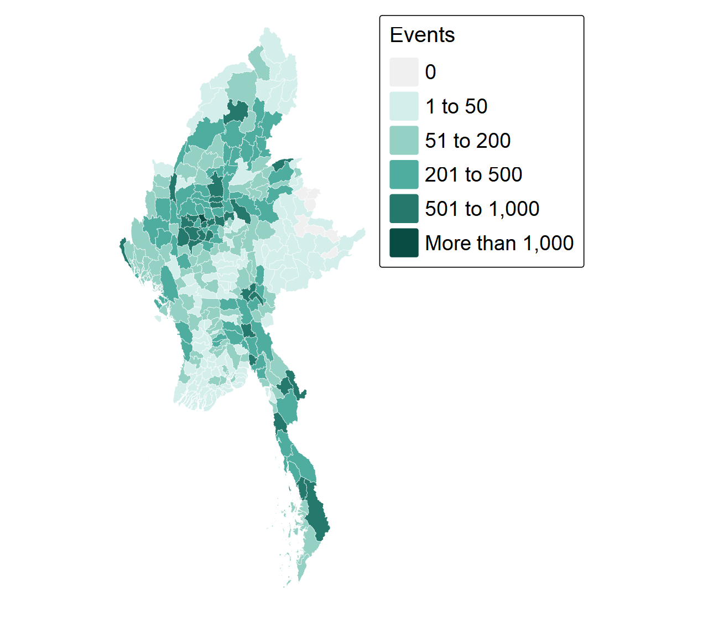
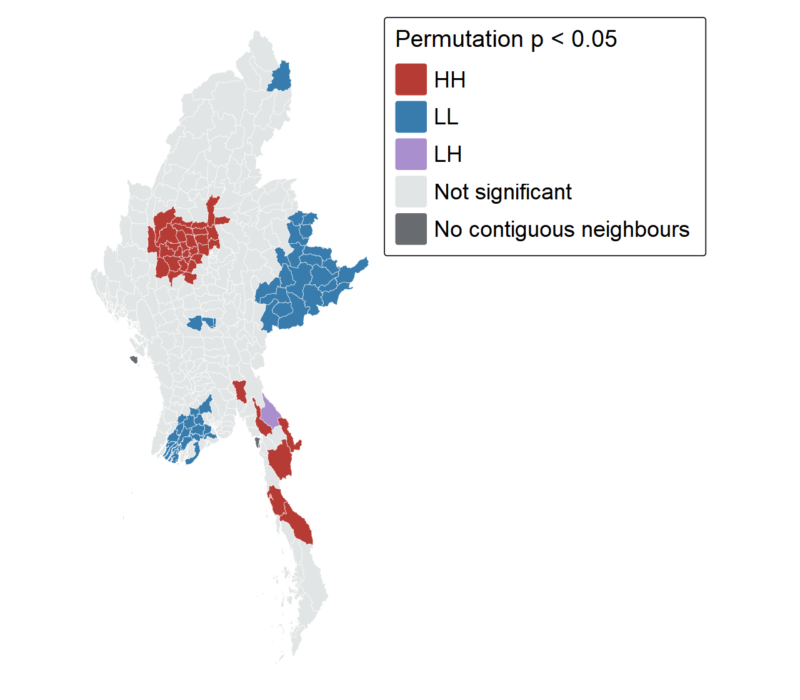
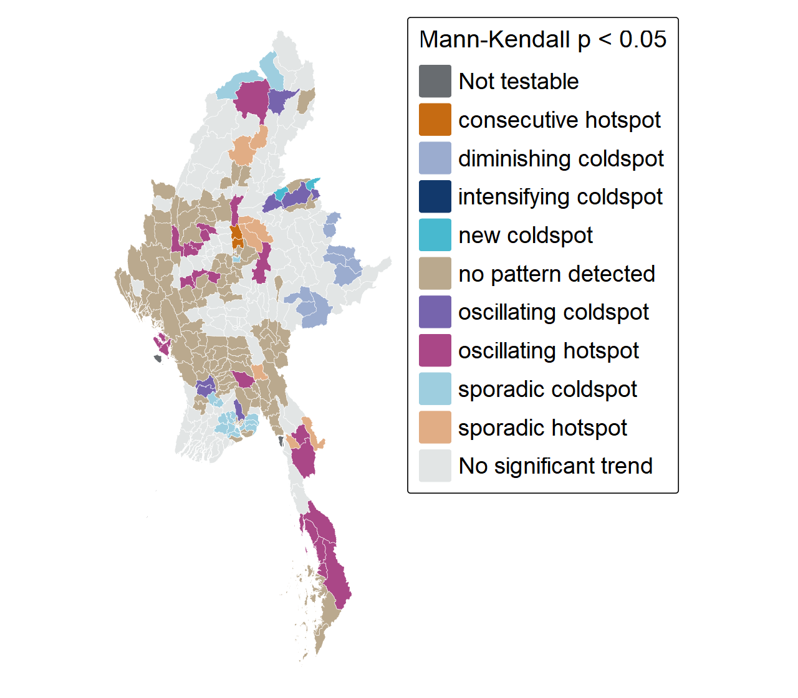
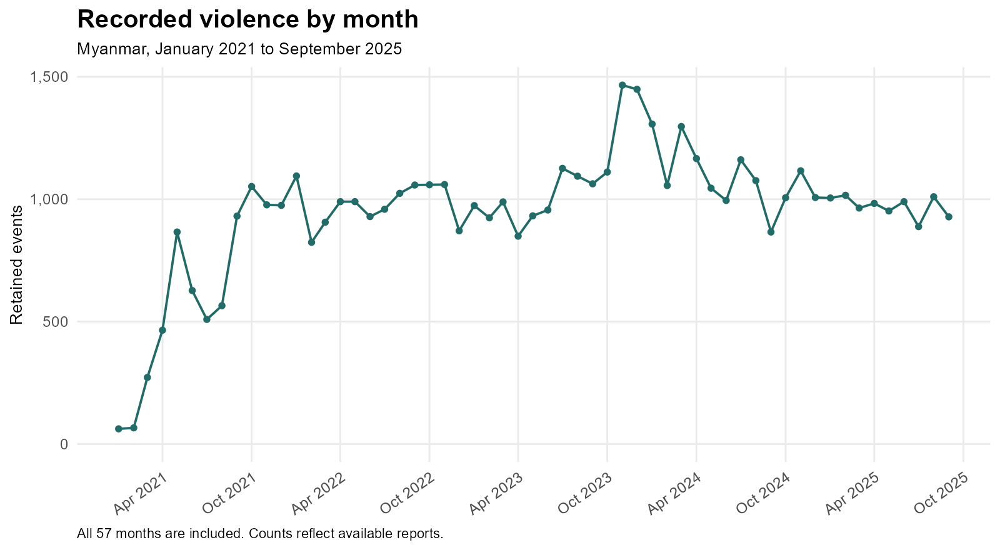

```{r}
#| include: false
source('R/cache-guard.R')
verify_analysis_fingerprint()
eh <- readRDS('data/processed/ehsa.rds')
```

## Questions and scope

::: {.columns}
::: {.column width="58%"}
1. Where are recorded events concentrated?
2. Which townships cluster with, or differ from, their neighbours?
3. How do local hot and cold spot patterns change over time?
:::
::: {.column width="38%"}
**330 townships · 57 months**

Battles, explosions and remote violence, and violence against civilians.

The outcome is a count of recorded events. It is not population-adjusted risk.
:::
:::

::: {.source-note}
Sources: supplied ACLED snapshot; official Myanmar Township Boundaries MIMU v9.4.
:::

## From records to a complete panel

::: {.columns}
::: {.column width="48%"}
| Preparation step | Events |
|---|---:|
| Original CSV |87,109|
| Myanmar, three event types |54,000|
| Geographic precision 1 or 2 |53,907|
| Unique township assignment |**53,899**|

93 broad-location records and eight unmatched points are excluded.
:::
::: {.column width="47%"}
- Coordinate joins use unique township PCODEs.
- 102 records with missing township names still have a unique spatial match.
- **18,810 township-month rows**, including 9,533 zero counts.
- Zero means no retained record, not confirmed absence of violence.
:::
:::

## Recorded activity is uneven

::: {.columns}
::: {.column width="62%"}
{.map-image fig-alt="Township cumulative event counts showing uneven concentrations across Myanmar."}
:::
::: {.column width="34%"}
**Monywa: 1,039 events**

Kawkareik: 946; Myaing: 934.

The ten highest-count townships contain **15.9%** of all retained events.

Explosions and remote violence form the largest event category: **42.5%**.

High counts alone do not establish a significant hotspot.
:::
:::

## Local clusters concentrate in central Myanmar

::: {.columns}
::: {.column width="62%"}
{.map-image fig-alt="Significant Local Moran clusters and outliers, with central high-high clusters and a low-high outlier in Kayin."}
:::
::: {.column width="34%"}
**Moran: 35 HH, 49 LL, one LH**

Sagaing has 17 HH townships; Mandalay seven and Magway five.

Hlaingbwe is the LH outlier: 61 events, p = 0.004.

**Gi\*: 35 hot, 50 cold spots**

After BH adjustment, 15 Moran HH and 17 Gi* hotspots remain.
:::
:::

::: {.source-note}
Queen/W weights; 999 permutations; two-sided p < 0.05. Three isolated townships are not classified. HH = high-high; LL = low-low; LH = low-high.
:::

## How the emerging patterns are measured

1. Build the same **330 × 57** township-month cube.
2. Calculate Gi* using each township and its Queen neighbours in the **current and previous month**.
3. Combine the monthly signs and significance history with the **Mann–Kendall trend**.

::: {.callout-note}
Monthly hotspot significance and a significant trend are different results. A persistent hotspot can have no significant upward or downward trend.
:::

::: {.source-note}
999 permutations; seed 6262027. Classroom sfdep uses undoubled smaller-tail bin p ≤ 0.05; the primary map uses MK p < 0.05. January 2021 has no prior bin. Tested local rules correct category handling without changing Gi* values.
:::

## Emerging patterns with significant trends

::: {.columns}
::: {.column width="62%"}
{.map-image fig-alt="Emerging hot and cold spot categories displayed for townships with significant Mann-Kendall trends."}
:::
::: {.column width="34%"}
**`r sum(eh$results$significant_trend)` townships have MK p < 0.05.**

`r sum(eh$results$trend_direction=='increasing Gi*')` have increasing Gi* and `r sum(eh$results$trend_direction=='decreasing Gi*')` have decreasing Gi*.

**86** have a named hot/cold history; **123** have no named pattern (tan).

Nine diminishing coldspots are in Shan. Lanmadaw in Yangon is the only intensifying coldspot.

Fourteen persistent coldspots have no significant MK trend and are neutral here.
:::
:::

## Read the spatial and monthly results together

::: {.columns}
::: {.column width="65%"}
{.trend-image fig-alt="Monthly retained event totals, with the peak in November 2023."}
:::
::: {.column width="31%"}
**Peak: November 2023**

1,466 recorded events.

January–September totals fall from 9,969 in 2024 to 8,736 in 2025 (**−12.4%**).
:::
:::

**Monywa:** a full-period HH cluster, but no significant Gi* trend (p = 0.066).

**Madaya:** an HH cluster with increasing Gi* (tau = 0.604, p < 0.001).

::: {.source-note}
A national decline does not establish that every township improves, or that reporting stayed constant.
:::

## Limits and implications for peacebuilding

::: {.columns}
::: {.column width="48%"}
**What the evidence supports**

- Use recurring concentrations to prioritise contextual review.
- Consider adjoining townships when discussing service access and civilian protection.
- Check maps against local knowledge and independent evidence of needs.
:::
::: {.column width="48%"}
**What remains uncertain**

- Reporting access and location precision.
- Counts without population or harm denominators.
- Multiple tests and temporal dependence in MK.
- Causes of clusters and changes.

A coldspot is not a declaration of safety.
:::
:::

::: {.source-note}
[Technical report and references](technical-report.qmd) · [Exercise overview](Take-home_Ex02.qmd). ACLED; MIMU v9.4; spdep; sfdep; Esri EHSA category definitions.
:::
